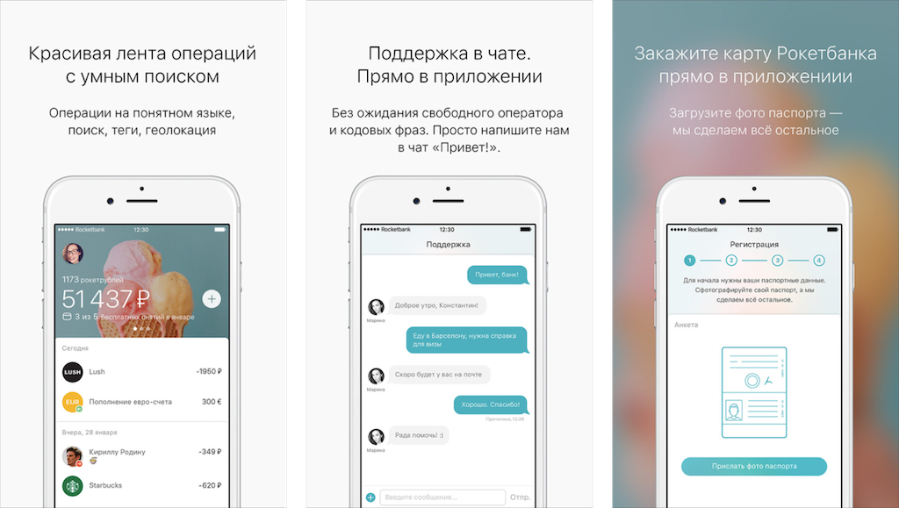

# Без человечности хорошо не&nbsp;получится {#humane}

Продукт должен &laquo;закрывать&raquo; потребность целевой аудитории. Это факт. Должен решать задачи пользователя. Тоже верно. Но&nbsp;есть ещё одно качество&nbsp;&mdash; человечность.

Если продукт не&nbsp;привлекает, человек всё равно *может* им&nbsp;пользоваться. Если нет других альтернатив или его заставляют по&nbsp;работе. Но&nbsp;от&nbsp;такого продукта человек сбежит при первой возможности.

> Компания Адоб годами выпускала посредственный графический редактор Фотошоп. И&nbsp;вроде&nbsp;бы даже дизайнеры уже привыкли рисовать в&nbsp;нем интерфейс. Но&nbsp;как только появился Скетч, который *был создан* для проектирования интерфейсов, десятки тысяч дизайнеров переметнулись к&nbsp;нему.

Бесчеловечный продукт = посредственный продукт

Если&nbsp;же продукт привлекает, пользователь простит ему мелкие грешки и&nbsp;шероховатости. А&nbsp;если человек в&nbsp;восторге от&nbsp;программы&nbsp;&mdash; начнет &laquo;продавать&raquo; её&nbsp;другим.

> Хрестоматийный пример привлекательного продукта&nbsp;&mdash; айфон: религиозная одержимость фанатов настолько общеизвестна, что над ней даже шутить перестали. Ещё примеры человечности: гуглопочта, Тесла, Рокетбанк.

<figure class="image">
    
    <figcaption>Клиенты так лояльны к&nbsp;Рокетбанку, что легко простили ему некрасивую историю <a href="https://vc.ru/p/rocket-situation">с&nbsp;Интеркоммерцем</a></figcaption>
</figure>

Красивой обертки недостаточно, чтобы сделать интерфейс человечным. Придется ещё с&nbsp;самого начала проектировать его под конкретных живых людей из&nbsp;вашей целевой аудитории. Купер называет их&nbsp;*персонажами*.
