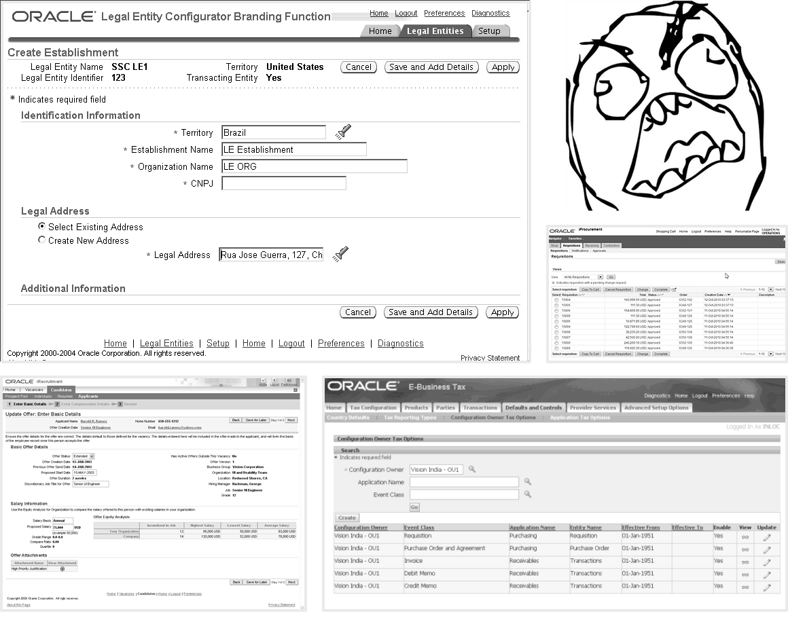

# Больше всего внимания&nbsp;&mdash; ключевым персонажам {#keypersona}

Не&nbsp;каждому персонажу нужен отдельный интерфейс. Начальник отдела спокойно использует интерфейс ЦРМ, спроектированный для продавца. Дизайнер скрепя сердце рисует интерфейс в&nbsp;фотошопе. Администратор группы в&nbsp;фейсбуке смотрит на&nbsp;ленту постов через ту&nbsp;же амбразуру, что и&nbsp;все остальные.

Но&nbsp;для некоторых персонажей без отдельного интерфейса не&nbsp;обойтись. Маркетолог запускает через ЦРМ рекламные компании, и&nbsp;интерфейс продавца ему не&nbsp;подходит. Архитектор фотошопом ну&nbsp;никак не&nbsp;обойдётся. Разработчику нужна АПИ-консоль фейсбука, а&nbsp;не&nbsp;лента.

Таких персонажей Купер называет *ключевыми*.

Хорошо, когда ключевой персонаж один. Плохой знак, если их&nbsp;больше трёх: возможно, вы&nbsp;охватили одной программой слишком много.

<figure class="image">
    
    <figcaption>Это ОЕБС&nbsp;&mdash; Оракл Ебизнес Сьют. Программа автоматизирует в&nbsp;одном интерфейсе ВСЕ бизнес-процессы: бухгалтерия, учёт, закупки, кадры, склад, управление проектами, &hellip; Благодаря этому в&nbsp;ней не&nbsp;работает НИЧЕГО.   Настоящую работу клеркам приходится вести рядом, в&nbsp;экселе и&nbsp;специализированных программах, а&nbsp;в&nbsp;ОЕБС перебивать результаты для руководства. Поскольку руководство ОЕБСом пользоваться тоже не&nbsp;может, специальные люди вытаскивают для них отчеты в&nbsp;эксель. Не&nbsp;шучу, реально так работает. Сотрудники ОЕБС <em>ненавидят</em>.</figcaption>
</figure>

Ключевому персонажу&nbsp;&mdash; отдельный интерфейс

Ключевым персонажам дизайнер уделяет больше всего времени при проектировании интерфейса, на&nbsp;то&nbsp;они и&nbsp;ключевые.

Чтобы сделать интерфейс под персонажа, голого описания недостаточно. Понадобятся ещё цели (ради чего человек использует продукт) и&nbsp;сценарии (как он&nbsp;добивается целей с&nbsp;помощью продукта).
