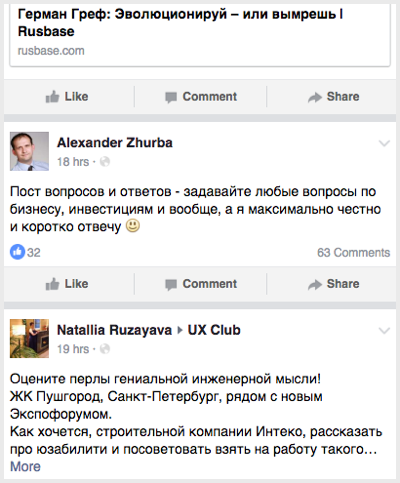
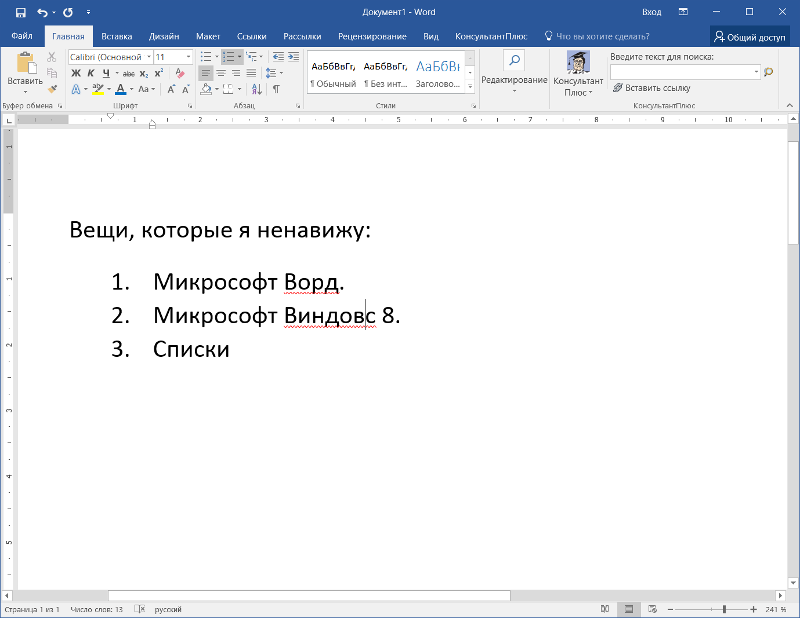
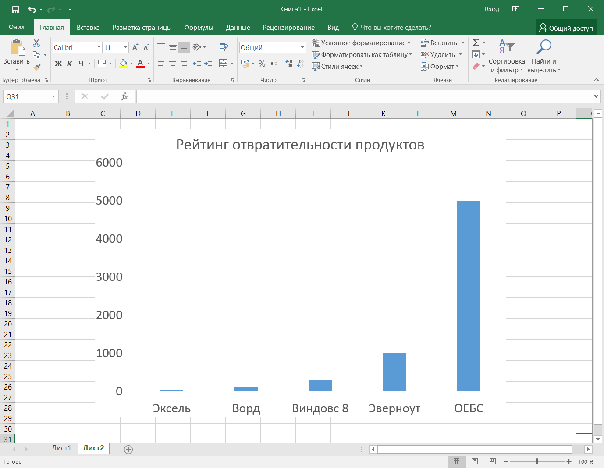

# Персонажи и&nbsp;цели {#personagoals}

Сложно оценить, насколько хорош интерфейс, если не&nbsp;понять, ради чего люди будут его использовать. Лента фейсбука показывает не&nbsp;все посты в&nbsp;хронологическом порядке, а&nbsp;только избранные по&nbsp;хитрому алгоритму. Это хорошо или плохо?

Ответ зависит от&nbsp;целей пользователя:

>&nbsp;&mdash; Зачем ему лента? 
>&nbsp;&mdash; Чтобы прочитать что-нибудь интересное и&nbsp;быть в&nbsp;курсе, что там у&nbsp;знакомых новенького.

Тогда хронология не&nbsp;нужна, она не&nbsp;приближает к&nbsp;цели. Что нужно, так это влезть человеку в&nbsp;голову, понять, что прямо сейчас привлечет его&nbsp;внимание, и&nbsp;показать в&nbsp;ленте. Ровно это и&nbsp;пытается сделать фейсбук&nbsp;&mdash; значит, решение хорошее.

<figure>
  
  <figcaption>Где мои котики, фейсбук?</figcaption>
</figure>

Купер разделяет цели на&nbsp;личные и&nbsp;практические.

*Личные* цели всегда одни и&nbsp;те&nbsp;же, с&nbsp;каким&nbsp;бы интерфейсом человек ни&nbsp;работал:

- не&nbsp;чувствовать себя глупо;
- не&nbsp;ошибаться;
- не&nbsp;наработать лишнего;
- развлечься или хотя&nbsp;бы не&nbsp;страдать от&nbsp;скуки.

Если программа препятствует личным целям, она никогда не&nbsp;будет привлекать и&nbsp;радовать человека. Её&nbsp;потолок&nbsp;&mdash; унылая посредственность.

<figure class="image">
    
    <figcaption>Ворд умеет все, что&nbsp;требуется. Но&nbsp;постоянно заставляет чувствовать себя идиотом. Не&nbsp;верите&nbsp;&mdash; поработайте со&nbsp;списками. </figcaption>
</figure>

<figure class="image">
    
    <figcaption>На&nbsp;удивление, Эксель намного приятней. Простые диаграммы, быстрые фильтры, адекватно угадывает формулы.</figcaption>
</figure>

*Практические* цели говорят о&nbsp;пользе для человека или компании, на&nbsp;которую он&nbsp;работает:

- больше продавать тем, кто раньше уже купил;
- спланировать проект так, чтобы не&nbsp;напортачить потом со&nbsp;сроками;
- сбросить лишний вес.

Практические цели&nbsp;&mdash; это мостик от&nbsp;персонажей к&nbsp;функциям программы. Определили персонажа и&nbsp;его цели &rarr; описали сценарии, которые к&nbsp;этим целям приводят &rarr; нарисовали под них интерфейс.
