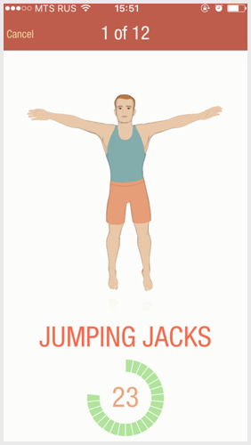

# Сценарии {#scenario}

Сценарии описывают, как человек использует продукт, чтобы добиться целей.

*Повседневные* сценарии пользователь проходит каждый день. Помните Мишу из&nbsp;первой части, который решил сбросить вес за&nbsp;7&nbsp;минут в&nbsp;день? Так&nbsp;вот:

> Теперь каждое утро после подъема Миша, зевая, делает несколько махов руками и&nbsp;наклонов, для разминки. Затем открывает на&nbsp;айфоне приложение и&nbsp;одним тыком запускает тренировку.

> 12&nbsp;упражнений по&nbsp;30&nbsp;секунд на&nbsp;каждое. Отдых между упражнениями&nbsp;&mdash; 10&nbsp;секунд. Чтобы Миша не&nbsp;запутался, приложение ему помогает: на&nbsp;экране анимированный человечек показывает технику упражнения, а&nbsp;из&nbsp;динамика тренер отсчитывает время и&nbsp;свистит в&nbsp;свисток. 

> Первые дни Миша поглядывает на&nbsp;экран, а&nbsp;потом ориентируется уже только на&nbsp;слух. К&nbsp;концу тренировки сердце ощущается где-то в&nbsp;районе ушей, так что Миша&nbsp;доволен: методика действует. Через месяц делает ремень туже на&nbsp;одну дырку и&nbsp;рекомендует воркаут друзьям и&nbsp;знакомым.

Повседневных сценариев у&nbsp;персонажа обычно один или&nbsp;два. Проектировщик уделяет им&nbsp;больше всего внимания и&nbsp;оптимизирует интерфейс, чтобы сценарии проходили с&nbsp;минимальным количеством телодвижений.

Повседневные сценарии часто поддерживают &laquo;короткие пути&raquo;: клавиатурные шорткаты, хитрые жесты на&nbsp;телефонах, шаблоны действий, значения по&nbsp;умолчанию из&nbsp;&laquo;вчера&raquo;.

Фокус&nbsp;&mdash; на&nbsp;повседневных сценариях

Кроме повседневных сценариев, Купер еще выделяет обязательные и&nbsp;экзотические.

*Обязательные* сценарии выполняют редко, но&nbsp;неукоснительно: сдать квартальный отчет, настроить переадресацию почты на&nbsp;время отпуска, продлить банковский депозит еще на&nbsp;год. Поскольку сценарии редкие, дизайнер не&nbsp;оптимизирует их&nbsp;по&nbsp;количеству действий и&nbsp;не&nbsp;&laquo;вылизывает&raquo; мельчайшие детали. Но&nbsp;закладывает больше подсказок и&nbsp;следит, чтобы человек понимал последствия каждого действия&nbsp;&mdash; ведь в&nbsp;прошлый раз он&nbsp;проходил сценарий давно и&nbsp;уже забыл, что к&nbsp;чему.

*Экзотические* сценарии выполняют единицы процентов пользователей: купить книгу за&nbsp;биткоины, восстановить сайт из&nbsp;резервной копии месячной давности, временно разблокировать банковскую карту, чтобы в&nbsp;чужой стране не&nbsp;остаться совсем без денег. Интерфейс такие сценарии поддерживает, и&nbsp;ладно&nbsp;&mdash; сильно заботиться об&nbsp;удобстве не&nbsp;обязательно. Совсем экзотику можно вовсе не&nbsp;выносить в&nbsp;интерфейс, а&nbsp;отдать на&nbsp;откуп техподдержке: пользователю проще решить вопрос с&nbsp;живым человеком, а&nbsp;разработчикам не&nbsp;придется тащить лишнюю функциональность.
