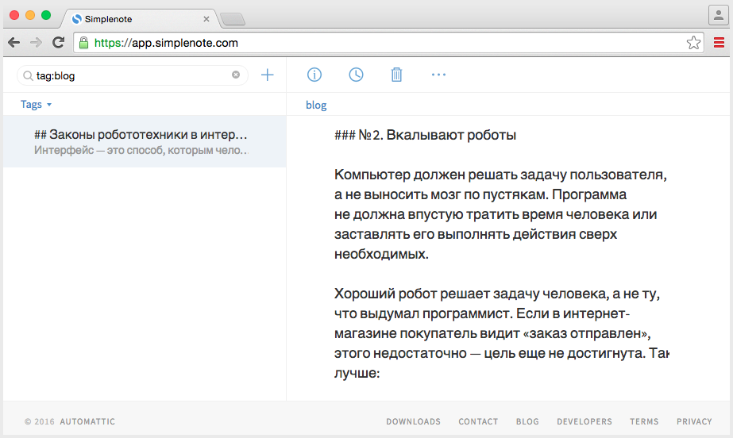
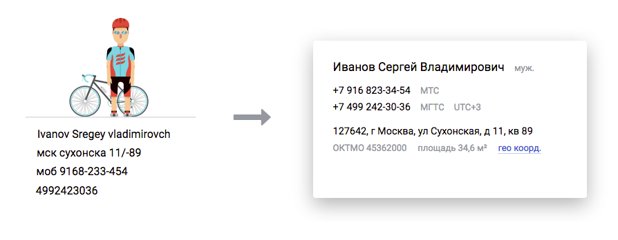
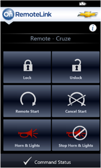

# Человечность

Проектирование через персонажей, цели и&nbsp;сценарии&nbsp;&mdash; необходимое, но&nbsp;не&nbsp;достаточное условие привлекательного продукта. Чтобы радовать людей, интерфейсу придется стать *человечным*.

Люди склонны наделять программы человеческими качествами. Глючный и&nbsp;тормозной интернет-магазин покупатель воспринимает как вонючего и&nbsp;тупого продавца в&nbsp;магазине офлайновом. Напротив, человек ответит добром, если чувствует: программа делает все, чтобы ему было хорошо. Пользователь простит баги и&nbsp;недочеты, даст обратную связь, рекомендует друзьям.

<figure>
    
    <figcaption>Пару лет назад <a href="https://simplenote.com/">Симплноут</a> сошел с&nbsp;ума и&nbsp;начал иногда терять данные при&nbsp;синхронизации. Я&nbsp;простил его и&nbsp;ждал, пока починят&nbsp;&mdash;&nbsp;только потому, что&nbsp;до&nbsp;этого продукт успел меня очаровать.</figcaption>
</figure>

Чтобы стать привлекательным, интерфейс, как деловой партнер, должен быть толковым, надежным и&nbsp;приятным в&nbsp;общении. Вот что конкретно это значит:

*Запоминать привычки человека* 
Если сегодня я&nbsp;настроил онлайн-радио на&nbsp;джазовую волну, то&nbsp;завтра возобновить вещание с&nbsp;нее&nbsp;же. А&nbsp;когда делаю второй заказ в&nbsp;магазине&nbsp;&mdash; подставить адрес доставки и&nbsp;способ оплаты от&nbsp;предыдущего заказа.

*Учитывать контекст и&nbsp;сообщать об&nbsp;отклонениях* 
Если я&nbsp;покупаю электронные весы, предложить добавить в&nbsp;заказ подходящие батарейки. Если обычно заказываю бытовую химию по&nbsp;мелочи, а&nbsp;тут вдруг положил в&nbsp;корзину 50 литров клея для плитки, аккуратно поинтересоваться&nbsp;&mdash; нет&nbsp;ли ошибки? Если из-за проблем в&nbsp;банке платежи идут два дня вместо обычных пяти минут&nbsp;&mdash; сообщить мне заранее, до&nbsp;оплаты, чтобы я&nbsp;мог передумать и&nbsp;оплатить яндекс-деньгами.

*Решать проблемы самостоятельно* 
Если платеж не&nbsp;прошел из-за технической ошибки, поставить в&nbsp;очередь и&nbsp;сообщить&nbsp;мне (а&nbsp;не&nbsp;отвалиться &laquo;извините, что-то пошло не&nbsp;так&raquo;). Если телефон указан как 916.345.85.59 или в&nbsp;середине емейла затесался пробел, привести к&nbsp;&laquo;каноническому&raquo; виду самостоятельно.

<figure>
    
    <figcaption><a href="https://dadata.ru/">Дадата</a> делает из&nbsp;огрызков яблоки: автоматически приводит в&nbsp;нормальный вид ФИО, телефоны и&nbsp;адреса; исправляет ошибки и&nbsp;восстанавливает недостающее.</figcaption>
</figure>

*Поддерживать черновики и&nbsp;промежуточные состояния процесса* 
Если я&nbsp;на&nbsp;&frac34; заполнил анкету на&nbsp;банковскую карту, а&nbsp;потом заметил, что забыл паспорт&nbsp;&mdash; сохранить как&nbsp;черновик, не&nbsp;передавать пока клеркам. Но&nbsp;дать мне возможность завтра продолжить с&nbsp;места, где сейчас остановился.

*Быть незаметным* 
Вот приложение, чтобы разблокировать автомобиль. Зима, минус десять и&nbsp;метель. Вы&nbsp;подходите к&nbsp;машине. Стягиваете с&nbsp;руки перчатку и&nbsp;выуживаете из&nbsp;кармана телефон. Жмете на&nbsp;кнопку, чтобы загорелся экран. Разблокируете телефон по&nbsp;отпечатку пальца. Жмете на&nbsp;кнопку &laquo;домой&raquo;. Тычете в&nbsp;иконку приложения. Ждете, пока загрузится. Наконец, жмете на&nbsp;&laquo;разблокировать двери&raquo;. Удо-о-обно.

А&nbsp;теперь так: вы&nbsp;подходите к&nbsp;автомобилю, он&nbsp;распознает вас по&nbsp;датчику в&nbsp;брелке и&nbsp;сам&nbsp;разблокирует двери. Интерфейса нет, но&nbsp;функция его выполняется.

Из&nbsp;этой&nbsp;же серии&nbsp;&mdash; автоматическое определение города покупателя в&nbsp;интернет-магазине, умная поисковая строка вместо кучки фильтров, иконка календаря c&nbsp;сегодняшним числом. Чем меньше интерфейса, тем лучше.
