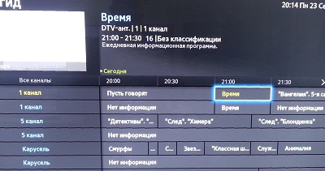

Почти двадцать лет назад Алан Купер написал скандальную книгу о пользовательских интерфейсах — «Психбольница в руках пациентов». Мнения в индустрии о ней несколько, кхм, противоречивые — из-за резкого тона и яростной критики, с которой Алан обрушился на разработчиков и менеджеров. Но в книге много дельного: это признают даже противники метода «персонажей», который предлагает Купер.

Мне фиолетовы категоричные высказывания автора: чего-чего, а провокаторов в интернете хватает. В книге напрягало другое: безбрежный океан воды, банальностей, самоповторов и консалтинговых заклинаний, в которых Купер утопил суть. Из-за этого рекомендовать книгу новичкам в дизайне не хочется — чего ради им терять столько времени впустую.

Но мысли-то в книги дельные! Самому иногда хочется к ним вернуться, только чтобы не продираться через толщу воды. В результате я решил книжку «обезжирить»:

- убрать всё, в чем не вижу практической пользы;
- не потерять примеры;
- опубликовать конспект в блоге.

Конспект пригодится тем, кто Купера не читал (бонус: теперь можно и не читать) и тем, кто хочет освежить материал.

# Чем сложнее, тем хуже {#complexity}

Чем больше действий надо совершить, чтобы применить функцию, тем меньше людей захотят это делать.

> Переключаться между каналами телевизора просто, все это делают. Добавить новый канал — уже сложнее. А заставить телевизор записать передачу в 13:40 без инструкции невозможно — и этой функцией никто не пользуется. В результате современный телевизор использует ничтожное количество возможностей: переключать каналы и регулировать звук.

<figure class="image">
    
    <figcaption>Как записать программу?</figcaption>
</figure>

<figure class="image">
    
    <figcaption>По-прежнему «элементарно», как и 20 лет назад</figcaption>
</figure>

Иногда в оправдание сложности интерфейса приводят пример с автомобилями:

> Человек учится четыре месяца, прежде чем получает право самостоятельно водить. В чем проблема потратить день на освоение программы?

Но единственная причина, почему люди специально учатся вождению — высокая цена ошибки. Ошибка за рулем приводит к увечьям и смерти. Если бы не это — люди учились водить методом тыка, как учатся Экселю.

**Сложный интерфейс = плохой интерфейс**

Другое возражение — про корпоративные программы: бухгалтерию, ЦРМ, складской учет.

> Сотрудникам платят за работу с этим софтом, так что пусть страдают, тоже мне неженки.

Действительно, выбора у сотрудников нет, поэтому работать будут. Но всё сэкономленное на разработке неудобной программы будет растрачено:

- на техподдержку,
- исправление ошибок,
- обучение новых сотрудников из-за высокой текучки,
- оплату неэффективной работы людей с программой, которую они ненавидят.

# Без человечности хорошо не получится {#humane}

Продукт должен «закрывать» потребность целевой аудитории. Это факт. Должен решать задачи пользователя. Тоже верно. Но есть ещё одно качество — человечность.

Если продукт не привлекает, человек всё равно *может* им пользоваться. Если нет других альтернатив или его заставляют по работе. Но от такого продукта человек сбежит при первой возможности.

> Компания Адоб годами выпускала посредственный графический редактор Фотошоп. И вроде бы даже дизайнеры уже привыкли рисовать в нем интерфейс. Но как только появился Скетч, который *был создан* для проектирования интерфейсов, десятки тысяч дизайнеров переметнулись к нему.

**Бесчеловечный продукт = посредственный продукт**

Если же продукт привлекает, пользователь простит ему мелкие грешки и шероховатости. А если человек в восторге от программы — начнет «продавать» её другим.

> Хрестоматийный пример привлекательного продукта — айфон: религиозная одержимость фанатов настолько общеизвестна, что над ней даже шутить перестали. Ещё примеры человечности: гуглопочта, Тесла, Рокетбанк.

<figure class="image">
    
    <figcaption>Клиенты так лояльны к Рокетбанку, что легко простили ему некрасивую историю <a href="https://vc.ru/p/rocket-situation">с Интеркоммерцем</a></figcaption>
</figure>

Красивой обертки недостаточно, чтобы сделать интерфейс человечным. Придется ещё с самого начала проектировать его под конкретных живых людей из вашей целевой аудитории. Купер называет их *персонажами*.

# Персонажи фокусируют на реальных людях {#persona}

Персонажи — не совсем реальные люди. Если поговорить с несколькими представителями целевой аудитории продукта, вы заметите у них общие черты, потребности, цели. Добавьте вымышленное имя и подробности биографии — и получите персонажа.

> Миша, 42 года, продает стройматериалы для дорогих коттеджей. В юности тягал штангу, а с годами все больше налегал на пиво вместо «железа» и к сорока годам ощутимо раздобрел. Немного переживает по этому поводу: не так, чтобы снова серьезно заняться спортом, но что-то сделать хочет.

<figure class="image">
    
    <figcaption>Миша суровый</figcaption>
</figure>

> Краем уха в курилке услышал о программе тренировок «воркаут за 7 минут»: несколько минут в день интенсивно потеешь, а результат как от часовой тренировки в зале. Миша заинтересовался, нашёл приложение в аппсторе и скачал.

Чем больше вы узнаёте предметную область, тем точнее становятся персонажи.

Для небольшой системы персонаж будет один, для крупной несколько. Но чем больше персонажей, тем запутаннее интерфейс — так что не увлекайтесь. Купер пишет, что круче всего проектировать для единственного пользователя, завоевать всего 10 % потенциальной аудитории, но зато вызывать у них стопроцентный восторг. Пример Apple показывает, что это действительно иногда работает :–)

Распространенная ошибка: персонаж-покупатель вместо персонажа-пользователя.

> Решение о покупке ЦРМ принимает директор по продажам. Логично под него и проектировать интерфейс, верно? Купер возражает: лучше проектировать для конечного пользователя — продавца. Если продавцы работают с ЦРМ продуктивно, то это успех и для начальника. А если продавцы от программы плюются и ведут сделки «под столом», то получается бардак, от которого директор пострадает первым. Это не значит, что потребности директора надо игнорировать, но ключевой персонаж — продавец.

Есть ещё один тонкий момент. Критики Купера обычно говорят: «да вы поглядите на этого чудака, он предлагает *выдумывать* персонажей». Конечно, это не так — Купер не предлагает брать описание «с потолка». Из выдуманного у персонажа — имя и забавные детали биографии. Остальное: потребности, привычки, навыки, где и когда человек работает с продуктом — всё настоящее. А имя и биографию выдумывают, чтобы не обидеть случайно реальных людей, на которых персонаж удивительно похож.

**Пока не поговорите с реальными пользователями, не получите персонажа**

# Больше всего внимания — ключевым персонажам {#keypersona}

Не каждому персонажу нужен отдельный интерфейс. Начальник отдела спокойно использует интерфейс ЦРМ, спроектированный для продавца. Дизайнер скрепя сердце рисует интерфейс в фотошопе. Администратор группы в фейсбуке смотрит на ленту постов через ту же амбразуру, что и все остальные.

Но для некоторых персонажей без отдельного интерфейса не обойтись. Маркетолог запускает через ЦРМ рекламные компании, и интерфейс продавца ему не подходит. Архитектор фотошопом ну никак не обойдётся. Разработчику нужна АПИ-консоль фейсбука, а не лента.

Таких персонажей Купер называет *ключевыми*.

Хорошо, когда ключевой персонаж один. Плохой знак, если их больше трёх: возможно, вы охватили одной программой слишком много.

<figure class="image">
    
    <figcaption>Это ОЕБС — Оракл Ебизнес Сьют. Программа автоматизирует в одном интерфейсе ВСЕ бизнес-процессы: бухгалтерия, учёт, закупки, кадры, склад, управление проектами,… Благодаря этому в ней не работает НИЧЕГО.   Настоящую работу клеркам приходится вести рядом, в экселе и специализированных программах, а в ОЕБС перебивать результаты для руководства. Поскольку руководство ОЕБСом пользоваться тоже не может, специальные люди вытаскивают для них отчеты в эксель. Не шучу, реально так работает. Сотрудники ОЕБС <em>ненавидят</em>.</figcaption>
</figure>

**Ключевому персонажу — отдельный интерфейс**

Ключевым персонажам дизайнер уделяет больше всего времени при проектировании интерфейса, на то они и ключевые.

Чтобы сделать интерфейс под персонажа, голого описания недостаточно. Понадобятся ещё цели (ради чего человек использует продукт) и сценарии (как он добивается целей с помощью продукта). О целях и сценариях — [во второй части статьи](http://antonz.ru/asylum-2/).

# Ω Резюме {#summary}

Если экономить время на проектировании интерфейса, продукт получится сложным. Сложные продукты всех бесят, а компании теряют на них деньги.

Чтобы продукт получился по-настоящему классным, он должен быть человечным. «Модный» интерфейс ≠ человечный интерфейс. Необходимое условие привлекательного продукта — проектирование под реальных пользователей. Инструмент проектирования — персонажи.

У персонажа есть имя, биография, привычки, цели и навыки. Имя и биография — вымышленные, всё остальное — настоящее, от реальных пользователей.

Ключевых персонажей обычно не больше трех, иначе продукт получится сложным.
