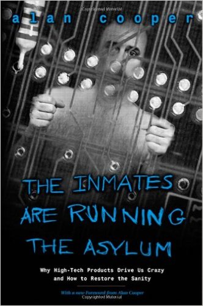

# «Психбольница» Купера 20 лет спустя

Обезжиренный конспект классической книги по&nbsp;UX, с&nbsp;примерами из&nbsp;современных интерфейсов.

Антон&nbsp;Жиянов, [Интерфейсы&nbsp;без&nbsp;шелухи](https://dangry.ru/)

◇&nbsp;◇&nbsp;◇

Почти двадцать лет назад Алан Купер написал скандальную книгу о&nbsp;пользовательских интерфейсах&nbsp;&mdash; &laquo;Психбольница в&nbsp;руках пациентов&raquo;. Мнения в&nbsp;индустрии о&nbsp;ней несколько, кхм, противоречивые&nbsp;&mdash; из-за резкого тона и&nbsp;яростной критики, с&nbsp;которой Алан обрушился на&nbsp;разработчиков и&nbsp;менеджеров. Но&nbsp;в&nbsp;книге много дельного: это признают даже противники метода &laquo;персонажей&raquo;, который предлагает Купер.

Мне фиолетовы категоричные высказывания автора: чего-чего, а&nbsp;провокаторов в&nbsp;интернете хватает. В&nbsp;книге напрягало другое: безбрежный океан воды, банальностей, самоповторов и&nbsp;консалтинговых заклинаний, в&nbsp;которых Купер утопил суть. Из-за этого рекомендовать книгу новичкам в&nbsp;дизайне не&nbsp;хочется&nbsp;&mdash; чего ради им&nbsp;терять столько времени впустую.

Но&nbsp;мысли-то в&nbsp;книге дельные! Самому иногда хочется к&nbsp;ним вернуться, только чтобы не&nbsp;продираться через толщу воды. В&nbsp;результате я&nbsp;решил книжку &laquo;обезжирить&raquo;:

- убрать всё, в&nbsp;чем не&nbsp;вижу практической пользы;
- не&nbsp;потерять примеры;
- опубликовать конспект в&nbsp;блоге.

Конспект пригодится тем, кто&nbsp;Купера не&nbsp;читал (бонус: теперь можно и&nbsp;не&nbsp;читать) и&nbsp;тем, кто&nbsp;хочет освежить материал.
